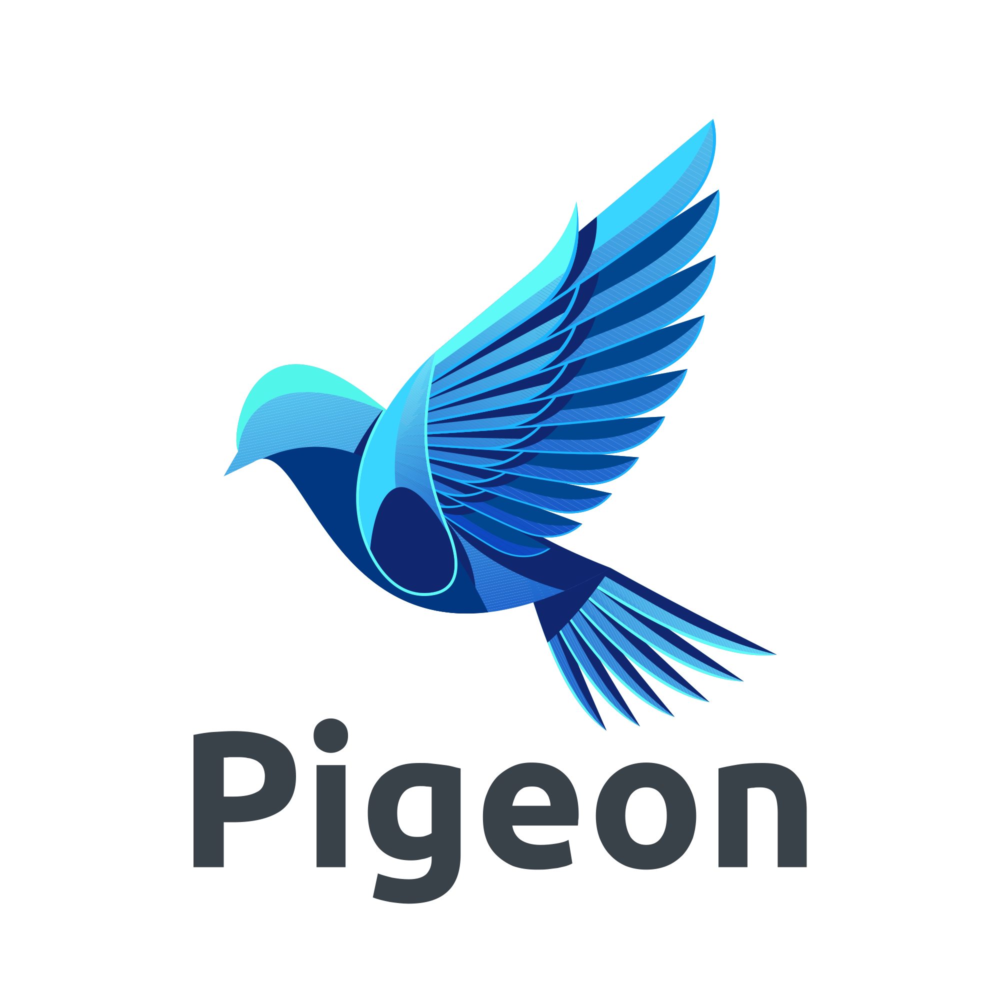

<h1 align="left" id="wdikiz-title">:wave: Hello there! I'm Walid Zoubir and this is my new account</h1>

[)]([https://www.linkedin.com/in/walid-zoubir-a46b81198/](https://linkedin.com/in/walid-zoubir-a46b81198))

**I am a versatilist and easily adapt to different hats (Full-Stack Software developer 🌐, App Developer 📱, ML Engineer 🤖🎨.....) depending on what the project requires. I love exploring new tech stack 💻 and leveraging them to build cool stuffs** 🛠️. 

  
### 🧐 More About Me:

- 🔭 &nbsp; I’m currently working on **Tferej Flix streaming App**
- 💻 &nbsp; With 2 Masters in software engineering and information systems management and 8 years' experience in development ;
- 👨🏻‍💻 &nbsp; Most of my projects are available on [Github](https://github.com/wdikiz?tab=repositories)
- 💬 &nbsp; Ask me about anything tech related, I am happy to help;
- 📫 &nbsp; Feel free to ping me on [LinkedIn](https://linkedin.com/in/walid-zoubir-a46b81198)
- 📚 &nbsp; When I am free, I do 3D printing .

 

### 👯 Communities
* Lead Google Developper Student Club .
* Microsoft Student Learn Ambassador (MSP/MLSA).
* Co-Founder of E-Translator App
* Member at Arab Team 4 Reverse Engineering.

 

### 🔨 Languages and Tools:

 
 

 

 

 
 

 

 

 

 

### 🛠️ My Projects

